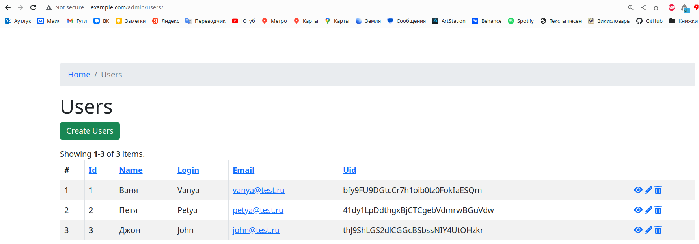

# Тестовое задание

## Запуск

1. Скачать репозиторий на локальную машину.
2. Перейти в папку с репозиторием.
3. Перейти в директорию `app`:
```shell
cd app
```

4. Установить пакеты:
```shell
composer install
```

5. Запустить окружение:
```shell
cd .. && docker-compose -f docker/docker-compose.yml up -d
```

6. Зайти в контейнер с приложением:
```shell
docker exec -it docker_app_1 bash
```

7. Запустить миграции БД:
```shell
php /var/www/app/yii migrate
```

При запуске миграций создадутся две таблицы: users и requests. В таблицы
будут добавлены данные.


Структура таблиц в БД следующая:


8. Создать папку для логов:
```angular2html
mkdir /var/www/app/log
```

9. Чтобы выйти из контейнера, вводим `exit`.

## Использование

Перейти по адресу http://www.example.com


Если видим что-то типа такого, необходимо добавить в файл hosts строку `127.0.0.1 www.example.com`.

Обновляем страницу. Показывает список всех пользователей.


Открываем страницу `www.example.com/request` для создания заявки. С помощью формы можно выбирать получателя 
и отправителя из списка пользователей, вводить текст заявки. 
При выборе пользователя данные о пользователе подгружаются с помощью Ajax и отображаются.


После отправки заявки получаем сообщение:


Перейдём на страницу пользователя, например `http://www.example.com/bfy9FU9DGtcCr7h1oib0tz0FokIaESQm`.


На странице отображаются данные пользователя, которому можно отправить сообщение, а также можно
выбрать отправителя и написать текст заявки.

Отправляем:


Перейдём в админку `http://www.example.com/admin/users` для управления пользователями:



С помощью админки просматривать, добавлять, удалять и редактировать пользователей.


По адресу `http://www.example.com/admin/requests` можно управлять заявками. Функционал тот же, что и 
с пользователями.

